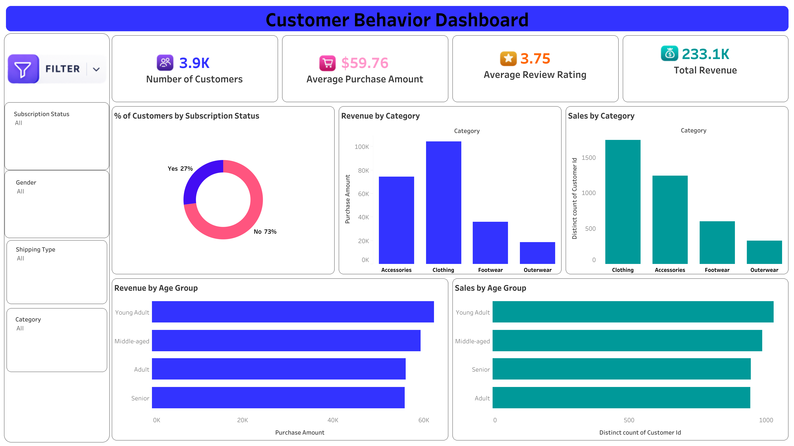

<div align="center">

# 🛍️ Customer Shopping Behavior Analysis

### End-to-End Data Analytics Project using SQL, Python & Tableau

Analyze customer purchasing behavior, uncover business insights, and build an interactive Tableau dashboard for data-driven decision-making.


</div>

---

# 📊 Dashboard Preview

<p align="center">
  
</p>

---

# 📌 Project Overview

This project analyzes customer shopping behavior using **SQL, Python, and Tableau** to identify purchasing trends, customer demographics, product performance, and revenue insights.

The project follows a complete analytics workflow from data cleaning to dashboard development, transforming raw data into meaningful business insights.

---

# 🎯 Business Objectives

- Analyze customer purchasing behavior.
- Identify top-performing product categories.
- Understand customer demographics.
- Measure business performance using KPIs.
- Create an interactive dashboard for decision-making.

---

# 📂 Dataset Information

| Attribute | Details |
|-----------|---------|
| Source | Kaggle |
| Dataset | Customer Shopping Behavior Dataset |
| Records | ~3,900 |
| Format | CSV |
| Domain | Retail Analytics |

---

# 🛠️ Technology Stack

| Technology | Purpose |
|------------|---------|
| Python | Data Cleaning & Analysis |
| Pandas | Data Manipulation |
| NumPy | Numerical Operations |
| SQL (MySQL) | Business Analysis |
| Tableau | Interactive Dashboard |

---

# 🔄 Project Workflow

```text
Kaggle Dataset
      │
      ▼
Python Data Cleaning
      │
      ▼
Exploratory Data Analysis
      │
      ▼
SQL Business Analysis
      │
      ▼
Interactive Tableau Dashboard
      │
      ▼
Business Insights
```

---

# 🧹 Data Cleaning

The dataset was cleaned using Python before analysis.

Cleaning steps included:

- Handling missing values
- Removing duplicate records
- Correcting data types
- Data validation
- Preparing the dataset for SQL and Tableau

---

# 📈 Exploratory Data Analysis (EDA)

EDA was performed using **Python** to understand customer behavior and purchasing trends.

The analysis focused on:

- Customer demographics
- Purchase amount distribution
- Revenue analysis
- Product category performance
- Customer review ratings
- Age group analysis

### Libraries Used

- Pandas
- NumPy

---

# 🗄️ SQL Business Analysis

A total of **10 SQL queries** were written to answer important business questions.

Examples include:

- Total Revenue
- Revenue by Gender
- Revenue by Category
- Revenue by Age Group
- Average Purchase Amount
- Customer Distribution
- Subscription Analysis
- Shipping Type Analysis
- Sales by Category
- Customer Count Analysis

---

# 📊 Dashboard Features

### KPI Cards

- 👥 Number of Customers
- 💰 Total Revenue
- 🛒 Average Purchase Amount
- ⭐ Average Review Rating

### Interactive Filters

- Subscription Status
- Gender
- Shipping Type
- Category

### Visualizations

- Revenue by Category
- Sales by Category
- Revenue by Age Group
- Sales by Age Group
- Customer Distribution by Subscription Status

---

# 💡 Key Business Insights

- Clothing generated the highest revenue.
- Young Adult customers contributed the highest purchase amount.
- Approximately **73%** of customers were non-subscribers.
- The average purchase amount was **$59.76**.
- The average review rating was **3.75**.
- Total revenue exceeded **233K**.

---

# 📁 Repository Structure

```text
Customer-Shopping-Behavior-Analysis
│
├── README.md
├── customer_shopping_behavior.csv
├── Customer_Shoping_Behavior_Analysis.ipynb
├── customer_behavior_queries.sql
├── Customer Behavior Dashboard.twbx
└── images
    └── dashboard.png
```

---

# 🚀 Getting Started

1. Download the dataset.
2. Run the Jupyter Notebook for data cleaning and EDA.
3. Import the cleaned data into MySQL.
4. Execute the SQL queries.
5. Open the Tableau workbook.
6. Explore the interactive dashboard.

---

# 🎯 Skills Demonstrated

- SQL Query Writing
- Data Cleaning
- Exploratory Data Analysis
- Customer Analytics
- Data Visualization
- Tableau Dashboard Development
- Business Intelligence
- Data Storytelling

---

# 📌 Future Improvements

- Customer Segmentation (RFM Analysis)
- Customer Lifetime Value (CLV)
- Sales Forecasting
- Power BI Dashboard
- Automated Data Pipeline

---

# 👨‍💻 Author

**Omkar Mishra**

📧 omkarm6379@gmail.com

💻 GitHub: https://github.com/0mkarMishra

---

<div align="center">

### ⭐ If you found this project helpful, please consider giving it a Star!

Thank you for visiting this repository.

</div>
